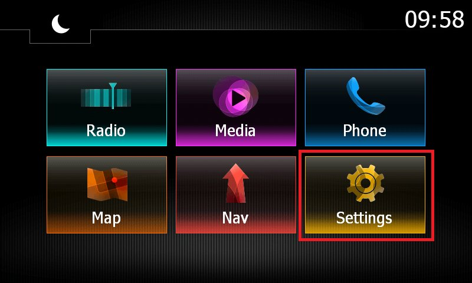
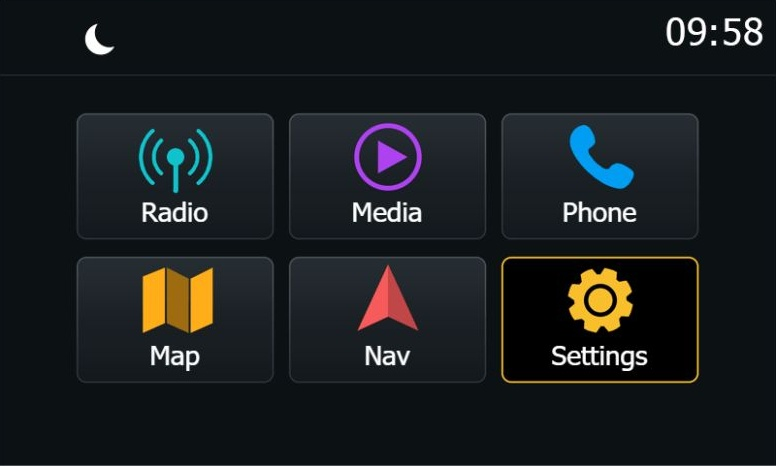

# MediaNav MAXmade — 7.0.6.MAX04

MAXmade is now developed here: patch tools, decompiled code, technical research and release evidence are published alongside this guide. Downloadable LGU files live in **GitHub Releases**.

Upgrade the **first-generation Renault / Dacia MediaNav** from 4.x to Evolution software, with the MAXmade improvements included in **one USB update**.

[Download upgrade.lgu](https://github.com/m-a-x-s-e-e-l-i-g/MediaNav-to-Evolution-Upgrade/releases/download/7.0.6.MAX04/upgrade.lgu) · [Release notes and checksum](releases/7.0.6.MAX04/README.md) · [Developer guide](docs/development.md)

## Why upgrade from 4.1.0 to 7.0.6.MAX04?

Compared with 4.1.0, the original upgrade to Evolution software brought these improvements on Max's unit:

- **Smoother Bluetooth music:** less stuttering, quicker phone connection and less waiting when changing songs.
- **Better touch response:** the screen reacts more quickly to taps.
- **Remembered volume:** the unit keeps your volume level when you turn off the car.
- **The Evolution interface:** newer software on your existing MediaNav.

MAXmade builds on that upgrade and adds:

- **Less Bluetooth audio delay:** reduces the lag between playback on your phone and sound from the speakers.
- **Eight saved phones instead of five:** remember more phones without deleting an old one first. The list has two pages; you still connect one phone at a time.
- **The navigation fix included:** the fix for the **“File corruption detected”** error is part of this update. You do not need to install a second update for it.

## New in 7.0.6.MAX04

- **Dark UI:** new Home, Radio, Media and Phone designs, with existing control positions retained.
- **Media fixes:** improved USB resume, repeat/shuffle, tags, artwork and playlists.
- **System fixes:** Bluetooth startup audio retry, touch-release and startup/error handling.
- **English updater/DBoot:** clearer update errors and verified file copies.

| Home | Media |
| --- | --- |
|  |  |

UI previews from real assets, with sample data and approximate fonts. Full before/after comparisons are in the [MAX04 release notes](releases/7.0.6.MAX04/README.md).

## Compatibility

This update is built for the **first-generation MediaNav**: the original unit that came with **4.x software**, such as **4.0.3, 4.0.5, 4.0.6 or 4.1.0**. The minimum starting version in this family is **4.0.3**.

You can upgrade directly to **7.0.6.MAX04**; installing 7.0.5.MD first is not required. First-generation units already converted to 7.0.5.MD are also within this guide's scope.

**Factory MediaNav Evolution units and later hardware generations are not supported by this package.** The Evolution software installed by this upgrade does not change your unit's hardware generation.

The [historical compatibility reports list vehicles and versions tested with the original upgrade](docs/compatibility.md#original-conversion-reports). Those reports do not yet confirm MAXmade compatibility.

## ⚠️ Check the [open issues](https://github.com/m-a-x-s-e-e-l-i-g/MediaNav-to-Evolution-Upgrade/issues) before you upgrade!

Just to warn you that this update is not always succesful and can introduce some unresolved issues.

## Requirements

- First-generation MediaNav running **4.x software (minimum 4.0.3)**, or the same hardware already converted to **7.0.5.MD**.
- [Radio (Unlock) Code](https://github.com/m-a-x-s-e-e-l-i-g/MediaNav-to-Evolution-Upgrade/blob/main/Radio_Code.md)
- USB Drive (min. 64MB, max. 4GB, FAT32 formatted)

## Before you start

1. Record your current **Settings > System > System version** and keep your [radio unlock code](Radio_Code.md).
2. Back up your unit if possible.
3. Write down your vehicle settings and radio presets; the update can replace them.
4. Use a USB stick of **64 MB to 4 GB, formatted FAT32**. Formatting erases the stick, so copy anything you need off it first.
5. Download [upgrade.lgu](https://github.com/m-a-x-s-e-e-l-i-g/MediaNav-to-Evolution-Upgrade/releases/download/7.0.6.MAX04/upgrade.lgu) from the release assets. Copy **only that upgrade.lgu** directly onto the USB stick, not inside a folder. Keep the filename `upgrade.lgu` and safely eject the stick from your PC.

This updates the system software as well as the apps. Installing MAXmade and returning to an older version have not yet been tested on the unit.

## Install 7.0.6.MAX04

1. Start the engine and wait for the normal MediaNav interface.
2. Insert the prepared USB stick. The offered update should identify the new version as **7.0.6.MAX04**. If there is no dialog or a different version appears, check the troubleshooting section before proceeding.
3. Accept the update by pressing **Update**.
4. Keep the engine running and leave the USB connected until the update has finished. The original full-update process can restart the unit several times and temporarily display Arabic text while installation continues.
5. Enter your radio code if prompted.
6. Once normal operation returns, remove the USB stick. Open **Settings > System > System version** and confirm **7.0.6.MAX04**.

## Access Windows CE with DBoot

**Windows CE** is the desktop underneath the normal MediaNav interface. **DBoot 2.0**, included in this update, lets you open it to copy files and make backups. Use it after installation is complete and the update USB has been removed.

1. Start from a **full boot** and watch the Renault/Dacia logo. Waking from standby can skip this screen.
2. When **DBOOT 2.0 - 2017** appears, swipe horizontally across **more than half the screen's width** in one continuous movement. Either direction works.
3. Press **OK** in the Windows CE prompt; **Annuler** cancels it.
4. Wait for the restart into the Windows CE desktop.

The boot-screen gesture window lasts about **five seconds**. If you miss it, retry on the next full boot. If the text never appears, check that DBoot is installed and the unit is not merely resuming from standby. Swiping in the normal interface depends on the installed `dboot.ini` configuration.

To return to MediaNav, double-tap **Redemarrer** and confirm. **Redemarrer WinCE** opens the prompt for another CE restart. The CE boot choice is one-time.

### USB and backup locations in CE

The USB mount is normally **MD**, under **My Device**. If it is missing, try **Start > Programs > USB PHY On**, then reconnect the stick and reopen My Device. The four **Storage Card** volumes are internal storage.

- Applications: `\Storage Card\System\Blue.exe` and `\Storage Card\System\AppMain.exe`.
- Bluetooth pairing database: `\Storage Card2\DATA\BLUE\sc_db.db`.

Copy backups from the unit to USB/PC and check that the copied files are readable.

## Accessing the MICOM Test menu

1. Go to Settings > System > System version.
2. Follow the image and press the screen at points 1 to 5.

   

3. Fill in code `0362` and press OK.
4. Fill in the second code `3748` and press OK.

## Troubleshooting

### No update dialog

Confirm the stick is FAT32, recognized by the unit and contains `upgrade.lgu` directly at its root. Check for an accidental extra extension such as `upgrade.lgu.lgu`. The version should be **7.0.6.MAX04**, which sorts above existing **7.0.5.MD** versions. If the installed version is equal or newer, the normal updater may not offer it. Report the current version if the correct package still does not appear.

### Returning to an older version

Returning from MAXmade to an older version has not been tested. The updater may refuse an older version number, and copying back the apps alone does not undo the full system update. The [compatibility notes](docs/compatibility.md#older-downgrade-instructions) explain the historical procedure and its limits.

## Technical details

For the download checksum, what is included and how the update was checked, see the [package notes](releases/7.0.6.MAX04/README.md) and [SHA256SUMS.txt](releases/7.0.6.MAX04/SHA256SUMS.txt).

## Development

| Start here | Contents |
| --- | --- |
| [Developer guide](docs/development.md) | Setup, repository layout and full-payload reproduction |
| [Source and tools](tools/README.md) | Patch code, verification fixtures, Ghidra exports and UI generators |
| [Research index](docs/research.md) | How the applications, Bluetooth, USB, updater and platform work |
| [Decompiled source](docs/source-index.md) | Address-linked C exports and module metadata |
| [Release workflow](docs/releases.md) | Full LGU builds, checks and GitHub Releases |

## Credits

MAXmade builds on the original **7.0.5.MD / FavreMod** conversion, DBoot and the included navigation corruption fix. Original contributors retain credit. Special thanks to [KwidTechsolutions](https://www.youtube.com/@KwidTechsolutions1).

[Provenance and credits](docs/provenance.md) records the original sources and tool versions. The old standalone packages remain in Git history; the current complete LGU is distributed through Releases.
