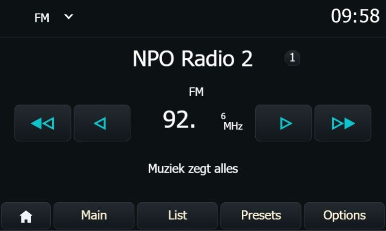
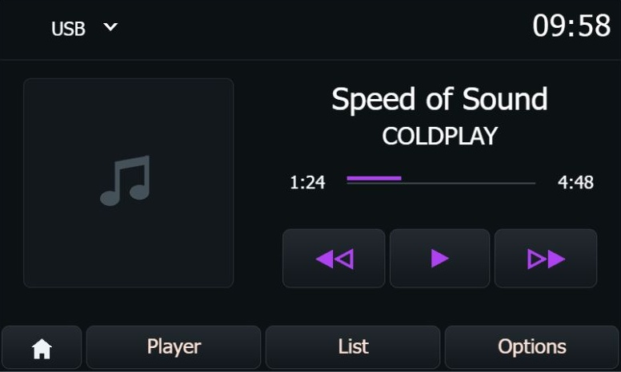
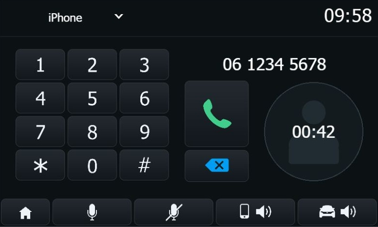

# MediaNav MAXmade — 7.0.6.MAX04

Full update for the **original Renault / Dacia MediaNav**, with a new dark UI and all previous MAXmade fixes.

[Download upgrade.lgu](Upgrade_706MAX04_MAXmade/upgrade.lgu) · [Changes and before/after screenshots](Upgrade_706MAX04_MAXmade/README.md) · [Checksum](Upgrade_706MAX04_MAXmade/SHA256SUMS.txt)

**Experimental:** package checks passed; full installation and runtime on the unit remain untested.

## New design

| Radio | Media | Phone |
| --- | --- | --- |
|  |  |  |

UI previews from real assets, with sample data and approximate fonts; not device photos.

## Improvements

### UI

- Dark Home, Radio, Media and Phone screens; existing control positions retained.
- Black active buttons, icon-colored outlines and white labels.
- Subtle album/caller placeholders and fixed source/search buttons.

### Bluetooth and USB

- Eight saved phones and the earlier Bluetooth audio-delay fix.
- One retry after a failed first Bluetooth audio opening.
- Better USB resume, repeat/shuffle, tags, artwork, playlists and folder handling.

### System

- Touch-release, startup and shared-memory error handling fixes.
- English updater/DBoot text and verified update copies.
- Existing navigation corruption fix retained; navigation design unchanged.
- Complete release: all **1,918** previous files and fixes included.

## Compatibility

- Original first-generation MediaNav, originally running **4.x** (minimum **4.0.3**).
- Includes the same hardware already converted to **7.0.5.MD**.
- Factory MediaNav Evolution and later hardware are unsupported.
- M1 artwork is included; other color profiles need contrast checks.

## Before you start

- Keep your [radio unlock code](Radio_Code.md), unit backup and tested CE/DBoot recovery access.
- Use a **64 MB–4 GB FAT32** USB stick.
- Save your presets and vehicle settings; the full update can replace settings.
- Check [open issues](https://github.com/m-a-x-s-e-e-l-i-g/MediaNav-to-Evolution-Upgrade/issues). Rollback remains untested.

## Install

1. Copy only `upgrade.lgu` to the USB root and safely eject it.
2. Start the engine, insert USB and confirm the offered version is **7.0.6.MAX04**.
3. Accept the update; keep the engine running and USB connected until finished.
4. Enter your radio code if asked; remove USB after normal operation returns.
5. Check **Settings > System > System version**, then radio, media, phone, navigation and vehicle controls.

## Previous versions and credits

- [MAX03 package](Upgrade_706MAX03_MAXmade/README.md) · [MAX03 detailed guide / CE access](docs/max03-guide.md).
- [Original 7.0.5.MD FavreMod guide](Upgrade_705MD_FavreMod/README.md), [navigation fix](File_Corruption_Fix) and [legacy removal package](remove_md_super_evo) are preserved.
- Based on the original FavreMod conversion and navigation fix; original contributors retain credit. Thanks to [KwidTechsolutions](https://www.youtube.com/@KwidTechsolutions1).
